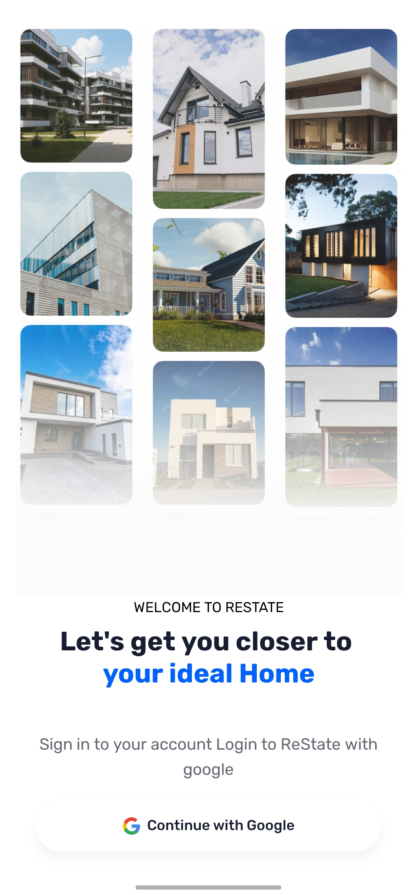
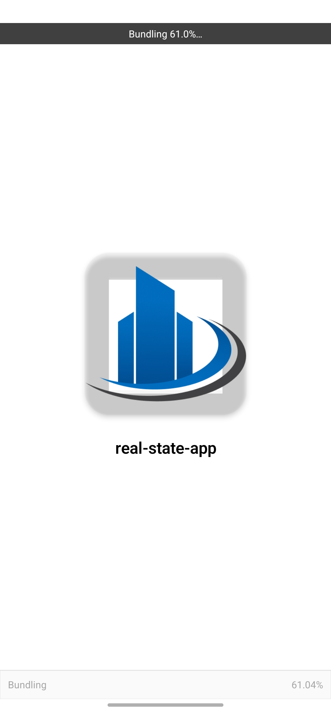
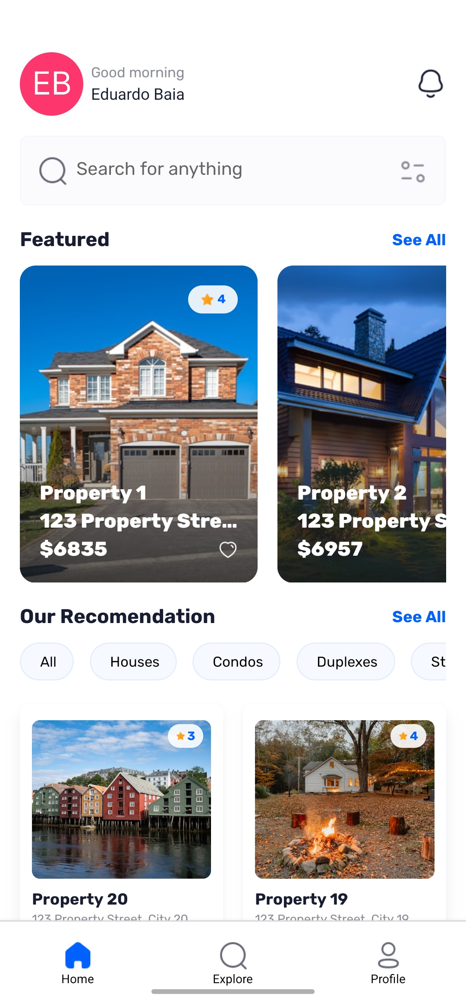
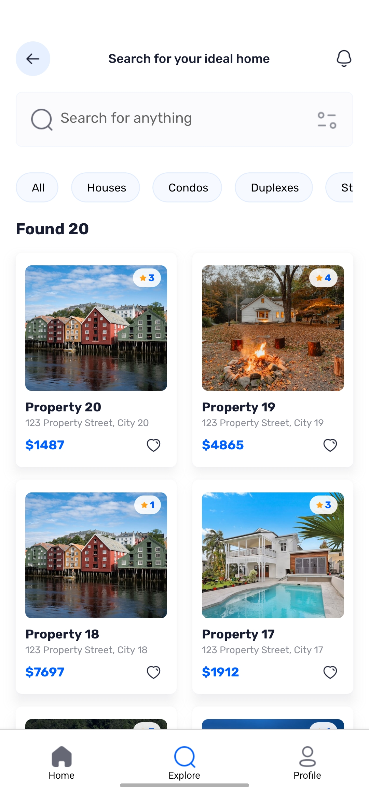
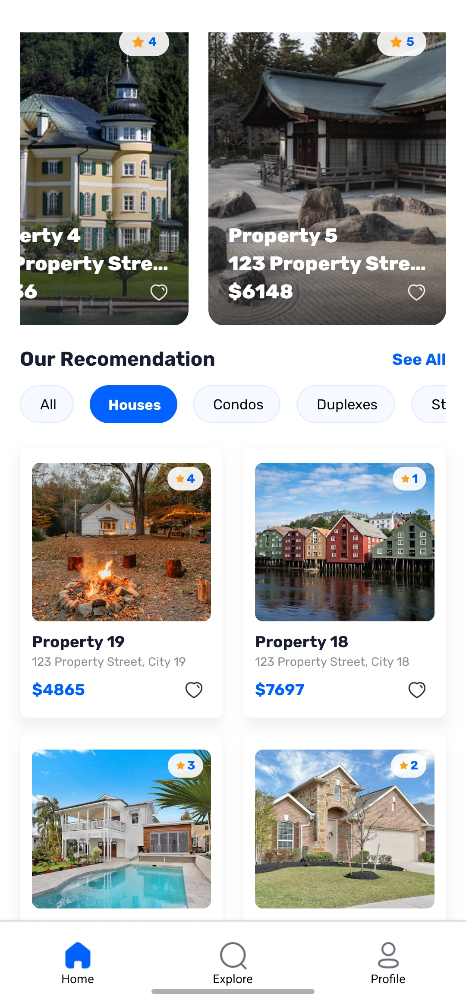
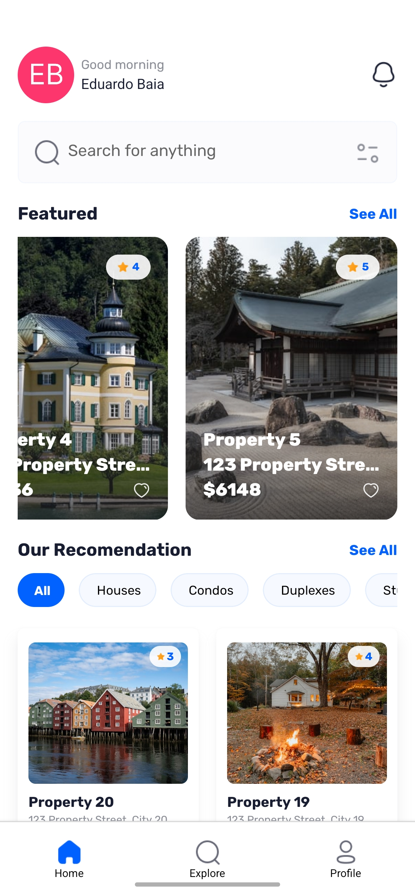

# 🏡 Real Estate App

A mobile application for browsing, buying, and renting real estate properties. Built with **React Native** using modern design, smooth navigation, and integration with property listing APIs.

---

## ✨ Features

- 📍 Browse properties by location
- 🔍 Filter by type, price, and area
- 🏠 View detailed property information
- ❤️ Save properties as favorites
- 📞 Contact property owners directly

---

## 🧪 Tech Stack

- React Native (Expo)
- TypeScript
- React Navigation
- Axios
- Firebase (authentication & database)
- Styled Components

---

## 📱 Screenshots

### 🏠 Home & Explore Screens

  
  
  
  

---

### ❤️ Property Recommendations

  
  

---

### 📋 Property Details

  

---

## 🚀 Getting Started

### 1. Clone the repository

 
git clone https://github.com/eduardobaia/real-state-react-native.git
cd real-state-react-native

### 2. Install dependencies

npm install
# or
yarn install

### 3. Start the development server (Expo)

npx expo start

### 🛠 Project Structure

.
├── assets/
│   └── readme/           # Screenshots for README
├── components/           # Reusable UI components
├── screens/              # Main screen components
├── navigation/           # App navigation config
├── services/             # API calls, firebase, etc.
├── App.tsx               # App entry point
└── ...

---
### 👨‍💻 Author

Made with ❤️ by Eduardo Baia
